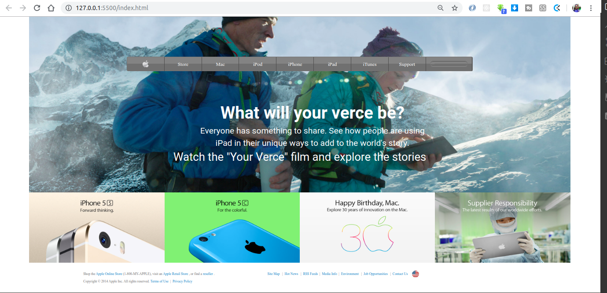
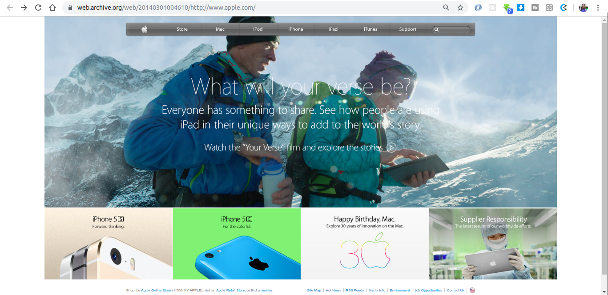

# Building with Backgrounds and Gradients

Old Apple web site page clone  with flex box .

## Captures

### My solution 

### Original from apple 

## Getting Started

One should download the project and open index.html file in a browser and voila!

## Built With

* [VS Code](https://code.visualstudio.com/) - The code editor used

## Contributing

Please read [CONTRIBUTING.md](https://gist.github.com/PurpleBooth/b24679402957c63ec426) for details on our code of conduct, and the process for submitting pull requests to us.

## Authors

* **Certil Remy** - [certilremy](https://github.com/certilremy) ,for contact Twitter @certilremy

## License

This project is licensed under the MIT License - see the [LICENSE.md](LICENSE.md) file for details
